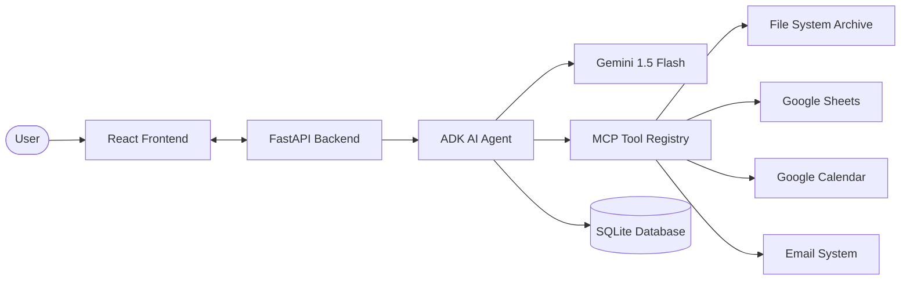

# � Expense Compliance AI Agent

[](https://www.python.org/)
[](https://fastapi.tiangolo.com/)
[](https://reactjs.org/)
[](https://github.com/google/braid-adk)
[](https://ai.google.dev/)

A professional, full-stack **Expense Compliance Agent** built with **Google ADK** and **Gemini 1.5 Flash**. This platform automates the entire corporate audit pipeline—from submission analysis to multi-channel notifications—all synchronized via the **Model Context Protocol (MCP)**.

---

## ⚡ Current Features

*   **🤖 Agentic Auditing**: Uses Gemini's reasoning to validate expenses against complex corporate policies (`fetch_policy`) and verify merchant credibility.
*   **🔌 Live MCP Integrations**:
    *   **Archive**: Every audit is deep-archived to the local **File System**.
    *   **Sheets**: Compliant expenses are logged to a master **Google Sheets** tracker.
    *   **Calendar**: Flagged violations automatically schedule **Google Calendar** reviews.
    *   **Email**: Automated **Email Notifications** are sent for every audit outcome.
*   **📊 Dynamic Dashboard**: Premium React UI featuring real-time compliance stats, spending trends, and a live **Integration Activity Feed**.
*   **🛡️ Security Harness**: Hardened with rate limiting, payload validation, and logic to detect malicious prompt injections.
*   **� Persistent Memory**: Full SQLite integration ensures all audit history is saved and retrievable.

---

## 🏗️ Architecture



---

## 🛠️ Tech Stack

- **Backend**: FastAPI, Google ADK, Structlog
- **Frontend**: React, Vite, Framer Motion, Lucide React
- **AI**: Gemini 1.5 Flash (via Google AI Studio)
- **Deployment**: Docker, GitHub Actions, Firebase Hosting
- **Security**: Pydantic v2, Custom Rate-Limiter

---

## 📂 Project Structure

```text
├── agents/             # ADK Agent Orchestration logic
├── config/             # System Prompts & Global Settings
├── harness/            # Security Guardrails (HITL, Rate-limiting)
├── tools/              # MCP Implementations (Calendar, Sheets, etc.)
├── frontend/           # Vite + React Dashboard
├── archives/           # Local FS MCP Audit Archives
├── Dockerfile          # Production Container Config
└── audit_history.db    # Local Persistence Layer
```

---

## 🚀 Local Setup

1.  **Environment**: Create a `.env` file with `GOOGLE_API_KEY`.
2.  **Backend**: `pip install -r requirements.txt` -> `python app.py` (Runs on Port 8001).
3.  **Frontend**: `cd frontend` -> `npm install` -> `npm run dev` (Runs on Port 3000).

---

## ☁️ Deployment Ready

This project is pre-configured for:
- **Google Cloud Run**: via `Dockerfile`.
- **Firebase Hosting**: via `firebase.json` (includes Cloud Run Proxy).
- **CI/CD**: Fully automated via GitHub Actions (`.github/workflows/deploy.yml`).

---

**Built with ❤️ during the Google Agent Development Course.**
